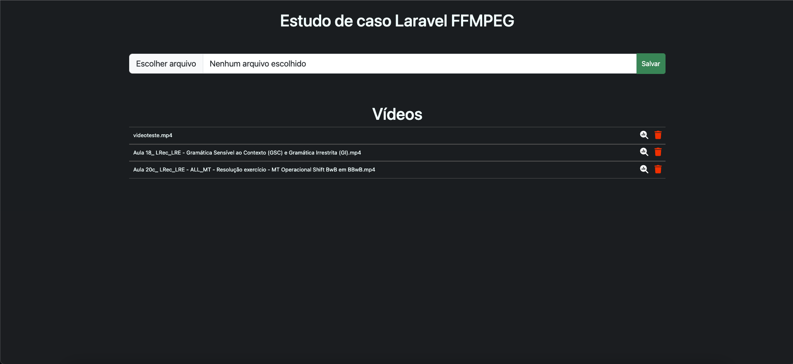
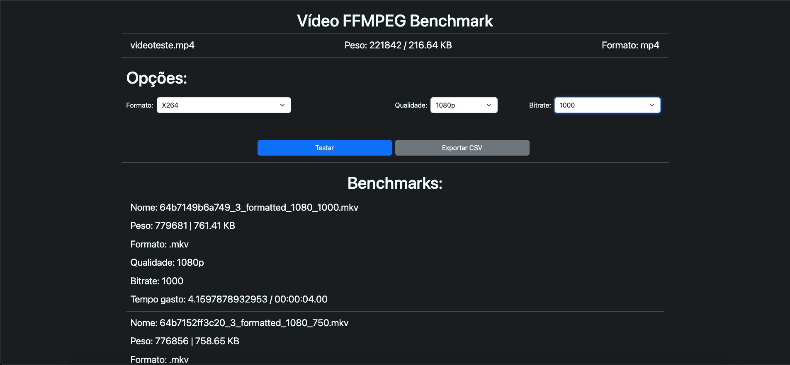

# Estudo de caso FFMPEG & Laravel

Neste estudo de caso, foi desenvolvida uma aplicação web para testes de performance e resultados de conversão de vídeo.

## Tecnologias utilizadas

- Laravel 10
- Docker
- FFmpeg
- MySQL

## Sobre a aplicação
A aplicação é bem simples, conta com duas telas somente. A tela inicial conta com um campo de arquivo para inserir um vídeo, além da listagem dos vídeos previamente carregados. 
A segunda tela temos a tela de benchmarking, onde existem opções de conversão, dado o vídeo, ele também traz os resultados anteriores e dá a opção de exportar os dados para csv
 

        

        

